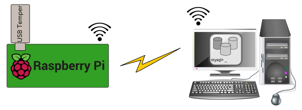
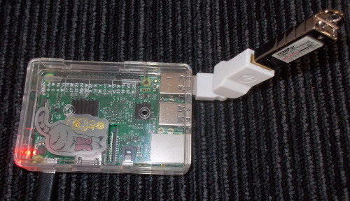
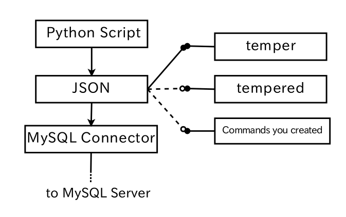

# Temperature logger for raspberry pi (logging to MySQL Server)<br>ラズパイの為の温度記録機構(MySQLサーバーへ記録)
⚙Connect the temperature sensor of USB connection to rasberry pi and use it.<br>
⚙USB接続の温度センサをrasberry piに接続して使用します。
<br>

## System configuration<br>システム構成
✓USB thermometer<br>
✓Rasberry pi<br>
✓MySQL server<br>
✓Wi-Fi connection<br>

<br>
⚙Raspberry pi whose operation has been verified is "3B" and "ZERO WH".<br>
⚙動作確認できているraspberry pi は"3B"と"ZERO WH"です。<br>

⚙Configuration example<br>
⚙構成例<br>

<br>
⚙Connect it by taking a distance from the sensor so as not to be affected by heat generation of raspberry pi.<br>
⚙raspberry piの発熱の影響を受けないように、センサから距離をとって接続します。

## Software configuration<br>ソフトウェア構成
Guaranteed version<br>
✓raspbian version 9.4<br>
✓Python 3.5.3 + mysql.connector<br>
⚙"mysql.connector" library must be installed separately<br>
⚙"mysql.connector"ライブラリは別途インストールする必要があります<br>
```
$ sudo apt-get -y install python3-mysql.connector
```
⚙Temperature sensor commands are called from the script.The command to be called can be switched by JSON file setting.You can specify a command (or script) you created yourself.In this sentence, we introduce commands dedicated to USB temperature sensor.However, it is also possible to create and use a command for the temperature sensor connected to the GPIO.<br>
⚙温度センサーコマンドは、スクリプトから独立しており、JSONファイルの設定で切り替えることができます。
この文章で紹介しているUSB温度センサ専用コマンドの他に、GPIOに接続した温度センサなどから温度を取得するコマンドやスクリプトを独自に作成して使用することも可能です。



## Check the temperature sensor, build the command.<br>温度センサーの確認とコマンドのビルド
⚙Although there is no distinction from the appearance, commands that can be used are different depending on the firmware.<br>
Connect the above USB temperature sensor to raspberry pi, execute lsusb, and check the device ID.<br>
⚙外見からは区別が付きませんが、ファームウェアによって、使えるコマンドが違います。<br>
raspberry piに上記USB温度センサを接続して、lsusbを実行し、デバイスIDを確認してください。
```
$ lsusb
Bus 001 Device 007: ID 0c45:7401 Microdia
```
⚙If "Microdia" and the vendor are displayed after the ID, the following command can be used.<br>
⚙IDの後に「Microdia」とベンダーが表示されれば以下のコマンドが使用できます。<br>
https://github.com/bitplane/temper
<br>

⚙Build the "clone" file and create "temper".<br>
When executed, time and temperature are output, but please remodel the source code slightly and output only the temperature.<br>
⚙cloneして、temper.cをビルドします。できたtemperを使用します。<br>
実行すると時刻と温度が出力されますが、ソースコードを少し改造して、温度だけを出力するようにしておいてください。

```
$ lsusb
Bus 001 Device 002: ID 413d:2107
```
⚙As mentioned above, if only ID is displayed, the following drivers can be used.<br>
⚙上記のように、IDしか表示されない場合は以下のドライバが使用できます。<br>
https://github.com/edorfaus/TEMPered
<br>

⚙If you clone this and build it, a lot of tools are generated, but only use tempered generated from tempered.c in the utils/ directory. In this case please also remodel so as to output only the temperedature.<br>
⚙これをcloneしてビルドすると、たくさんのツール群が生成されますが、使用するのはutils/ディレクトリのtempered.cから生成されるtemperedだけです。こちらの場合も温度だけを出力するように改造してください。

⚙Modified temper.c and tempered.c are bundled.Overwrite the clone original file and build it.However please be aware that it may be incompatible with the latest version.<br>
⚙改造済みのtemper.cとtempered.cは同梱しています。cloneした後に上書きしてビルドできると思います。しかし最新版と互換性がなくなっている可能性もありますのでご留意ください。

### Operation check<br>動作確認
```
$ ./temper
23.6800
```
or
```
$ ./tempered
23.6800
```
⚙After confirming the operation, please install the command in an arbitrary place.<br>
⚙動作の確認ができましたら、コマンドを任意の場所に設置してください。

## Preparing MySQL<br>MySQLの準備
⚙Prepare a database to store temperature on MySQL server<br>
The database name can be arbitrary.<br>
In the example below, we use a database called test.<br>
⚙MySQLサーバーに温度を格納するデータベースを用意します<br>
データベース名は任意でかまいません。<br>
下記の例では、testというデータベースを使用しています。
```
mysql> show databases;
+--------------------+
| Database           |
+--------------------+
| information_schema |
| test               |
+--------------------+
2 rows in set (0.00 sec)
```
⚙Create a table in the created database.<br>
The table name is TEMPER.<br>
⚙作成したデータベースにテーブルを作成します。<br>
テーブル名はTEMPERです。<br>
```
mysql> use test
Database changed
mysql> show tables;
+----------------+
| Tables_in_test |
+----------------+
| TEMPER         |
+----------------+
5 rows in set (0.00 sec)

```
⚙Set the fields in the table as follows.<br>
⚙テーブルにフィールドを以下のように設定します。
```
mysql> DESC TEMPER;
+--------+----------+------+-----+---------+----------------+
| Field  | Type     | Null | Key | Default | Extra          |
+--------+----------+------+-----+---------+----------------+
| ID     | int(11)  | NO   | PRI | NULL    | auto_increment |
| DATE   | datetime | YES  |     | NULL    |                |
| TEMPER | float    | YES  |     | NULL    |                |
+--------+----------+------+-----+---------+----------------+
3 rows in set (0.00 sec)
```
⚙Register the user who can access from the outside to this database.<br>
⚙このデータベースに外部からアクセスできるユーザーを登録をしてください。

## Install script<br>スクリプトの設置
⚙The script script consists of "temperedDB.py" and "temper.json".<br>
Please put two files in the same directory of your choice.<br>
⚙スクリプトは「temperedDB.py」と「temper.json」で構成されます。<br>
二つのファイルを任意の同じディレクトリに設置してください。

### Rewrite setting file<br>設定ファイルの書き換え
⚙Please open temper.json and rewrite its contents.<br>
Rewrite the "mysql" section according to the created MySQL database.<br>
Rewrite the "command" section according to the installation location of installed commands.<br>
⚙temper.jsonを開き、内容を書き換えてください。<br>
作成済みのMySQLデーターベースに合わせて"mysql"セクションを書き換えます。<br>
設置済みのコマンドの設置場所に合わせて"command"セクションを書き換えます。<br>
```
$ cat temper.json
{
  "mysql": {
    "host": "mysqlserver.local",
    "user" : "pitemper",
    "passwd": "12345",
    "db": "test"
  },
  "command": {
    "pass": "/home/pi/TEMPered/utils",
    "exe": "tempered",
    "param": "-c-2.045"
  }
}
```
⚙"param" is for tempered.c bundled. Please use empty when using temper.c which is included.<br>
"param" is for calibration of the acquired temperature.<br>
For "temper.c", specify the adjustment value of the source code.<br>
In the case of "tepered.c", it can be specified with command arguments.<br>
You can use "param" if you customized temper.c so that you can calibrate with arguments<br>
⚙"param"は同梱しているtempered.c用です。同梱しているtemper.cを使用する場合は空文にしてください。<br>
"param"は取得した温度のキャリブレーション用です。<br>
同梱のtemper.cの場合は、調整値をソースコード内で指定します。<br>
同梱のtepered.cの場合は、引数で指定できます。<br>
独自にtemper.cを改造して、引数でキャリブレーションをできるようにした場合は、"param"を使用できます。<br>

## Confirmation of script operation<br>スクリプトの動作確認
```
$ ./temperedDB.py
```
⚙Writes the temperature to the specified database at 30-second intervals.<br>
Adjustment can be made by argument "-w60", making it 60 second intervals.<br>
⚙30秒ごとに指定されたデータベースに温度を格納します。<br>
引数-w60で、60秒間隔にするなど、調整ができます。
```
mysql> select * from TEMPER where DATE >= '2018/10/24';
+--------+---------------------+--------+
| ID     | DATE                | TEMPER |
+--------+---------------------+--------+
| 181990 | 2018-10-24 09:21:39 | 20.265 |
| 181991 | 2018-10-24 09:22:13 | 20.325 |
| 181992 | 2018-10-24 09:22:46 | 20.325 |
| 181993 | 2018-10-24 09:23:19 | 20.325 |
| 181994 | 2018-10-24 09:23:52 | 20.325 |
| 181995 | 2018-10-24 09:24:25 | 20.325 |
| 181996 | 2018-10-24 09:24:59 | 20.325 |
| 181997 | 2018-10-24 09:25:32 | 20.385 |
| 181998 | 2018-10-24 09:26:05 | 20.385 |
+--------+---------------------+--------+
```

## Daemonize script<br>スクリプトをデーモン化する
⚙Please set the temperedDB.project file in "/etc/systemd/system".<br>
Open temperedDB.project and change the contents of ExecStart = to the place where the script was installed.<br>
You can adjust the temperature acquisition interval by specifying the argument -w.<br>
⚙/etc/systemd/system に temperedDB.project ファイルを設置してください。
temperedDB.projectを開き、ExecStart=の内容をスクリプトを設置した場所に書き換えてください。<br>
引数-wを指定することで、温度の取得間隔を調節できます。
```
[Unit]
Description=temperedDB daemon

[Service]
ExecStart=/home/pi/TEMPered/utils/temperedDB.py -w30
Restart=always
Type=simple
RemainAfterExit=yes

[Install]
WantedBy=multi-user.target
```
⚙Once editing is complete, activate the service.<br>
⚙編集が完了したら、サービスを有効化します。
```
$ sudo systemctl daemon-reload
```
⚙Run the script as a service.<br>
⚙スクリプトをサービスとして実行します。
```
$ sudo systemctl start temperedDB
```
⚙Check the status.<br>
⚙状態を確認します。
```
$ systemctl status temperedDB
● temperedDB.service - temperedDB daemon
   Loaded: loaded (/etc/systemd/system/temperedDB.service; enabled; vendor preset: enabled)
   Active: active (running) since Wed 2018-10-17 09:27:17 JST; 1 weeks 0 days ago
 Main PID: 216 (python3)
   CGroup: /system.slice/temperedDB.service
           └─216 python3 /home/pi/TEMPered/utils/temperedDB.py -w30

10月 24 15:25:37 solanarbp00 sudo[25765]: pam_unix(sudo:session): session closed for user root
10月 24 15:26:07 solanarbp00 sudo[25775]:     root : TTY=unknown ; PWD=/ ; USER=root ; COMMAND=/home/pi/TEMPered/utils/tempered -c-2.045
10月 24 15:26:07 solanarbp00 sudo[25775]: pam_unix(sudo:session): session opened for user root by (uid=0)
10月 24 15:26:10 solanarbp00 sudo[25775]: pam_unix(sudo:session): session closed for user root
10月 24 15:26:40 solanarbp00 sudo[25784]:     root : TTY=unknown ; PWD=/ ; USER=root ; COMMAND=/home/pi/TEMPered/utils/tempered -c-2.045
10月 24 15:26:40 solanarbp00 sudo[25784]: pam_unix(sudo:session): session opened for user root by (uid=0)
10月 24 15:26:43 solanarbp00 sudo[25784]: pam_unix(sudo:session): session closed for user root
10月 24 15:27:13 solanarbp00 sudo[25793]:     root : TTY=unknown ; PWD=/ ; USER=root ; COMMAND=/home/pi/TEMPered/utils/tempered -c-2.045
10月 24 15:27:13 solanarbp00 sudo[25793]: pam_unix(sudo:session): session opened for user root by (uid=0)
10月 24 15:27:16 solanarbp00 sudo[25793]: pam_unix(sudo:session): session closed for user root
```
⚙Stop the service.<br>
⚙サービスを停止します。
```
$ sudo systemctl stop temperedDB
```
⚙To execute the script automatically as a service at system startup, execute the following command.<br>
⚙スクリプトをシステムの起動時に自動的にサービスとして実行する場合は、以下のコマンドを実行してください。
```
$ sudo systemctl enable temperedDB
```
⚙By executing the following command it is possible to check whether automatic execution is enabled.<br>
⚙自動実行が有効になっているかを確認するには以下のコマンドを実行します。
```
$ sudo systemctl is-enabled temperedDB
enabled
```
⚙To cancel the automatic execution setting, execute the following command.<br>
⚙自動実行の設定を取り消す場合は以下のコマンドを実行します。
```
$ systemctl disable temperedDB
```
## Behavior on error<br>エラー時の動作
⚙If you can not connect to the MySQL database, the script stops for 3 minutes and attempts to connect again.<br>
If it fails a total of 10 times, the script will stop for 30 minutes. Then the script tries to reconnect.<br>
An example of syslog error output is shown below.<br>
⚙MySQLデータベースに接続できなかった場合、スクリプトは３分停止して、再度接続を試みます。<br>
上記が合計１０回失敗した場合、３０分停止した後、再接続を試みます。<br>
下記にsyslogのエラー出力例を示します。
```
Oct 24 06:28:28 solanarbp00 temperedDB.py[216]: TRY(7/10):2003: Can't connect to MySQL server on 'ayumi-Hi-Fi-H81S2.local:3306' (-2 Name or service not known)
Oct 24 06:31:33 solanarbp00 temperedDB.py[216]: TRY(8/10):2003: Can't connect to MySQL server on 'ayumi-Hi-Fi-H81S2.local:3306' (-2 Name or service not known)
Oct 24 06:34:38 solanarbp00 temperedDB.py[216]: TRY(9/10):2003: Can't connect to MySQL server on 'ayumi-Hi-Fi-H81S2.local:3306' (-2 Name or service not known)
Oct 24 06:37:43 solanarbp00 temperedDB.py[216]: TRY(10/10):2003: Can't connect to MySQL server on 'ayumi-Hi-Fi-H81S2.local:3306' (-2 Name or service not known)
Oct 24 07:10:48 solanarbp00 temperedDB.py[216]: TRY(1/10):2003: Can't connect to MySQL server on 'ayumi-Hi-Fi-H81S2.local:3306' (-2 Name or service not known)
Oct 24 07:13:53 solanarbp00 temperedDB.py[216]: TRY(2/10):2003: Can't connect to MySQL server on 'ayumi-Hi-Fi-H81S2.local:3306' (-2 Name or service not known)
Oct 24 07:16:58 solanarbp00 temperedDB.py[216]: TRY(3/10):2003: Can't connect to MySQL server on 'ayumi-Hi-Fi-H81S2.local:3306' (-2 Name or service not known)
Oct 24 07:20:03 solanarbp00 temperedDB.py[216]: TRY(4/10):2003: Can't connect to MySQL server on 'ayumi-Hi-Fi-H81S2.local:3306' (-2 Name or service not known)
Oct 24 07:23:08 solanarbp00 temperedDB.py[216]: TRY(5/10):2003: Can't connect to MySQL server on 'ayumi-Hi-Fi-H81S2.local:3306' (-2 Name or service not known)
Oct 24 07:26:14 solanarbp00 temperedDB.py[216]: TRY(6/10):2003: Can't connect to MySQL server on 'ayumi-Hi-Fi-H81S2.local:3306' (-2 Name or service not known)
Oct 24 07:29:19 solanarbp00 temperedDB.py[216]: TRY(7/10):2003: Can't connect to MySQL server on 'ayumi-Hi-Fi-H81S2.local:3306' (-2 Name or service not known)
Oct 24 07:32:24 solanarbp00 temperedDB.py[216]: TRY(8/10):2003: Can't connect to MySQL server on 'ayumi-Hi-Fi-H81S2.local:3306' (-2 Name or service not known)
Oct 24 07:35:29 solanarbp00 temperedDB.py[216]: TRY(9/10):2003: Can't connect to MySQL server on 'ayumi-Hi-Fi-H81S2.local:3306' (-2 Name or service not known)
Oct 24 07:38:34 solanarbp00 temperedDB.py[216]: TRY(10/10):2003: Can't connect to MySQL server on 'ayumi-Hi-Fi-H81S2.local:3306' (-2 Name or service not known)
```
-that's all-
